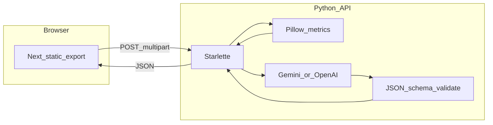

# AdCraft AI

**AdCraft** is a small full-stack tool for **critiquing static ad creatives** (display, landing hero, email hero, social). Upload an image and you’ll get **scores**, **issues**, **recommendations**, and an **annotation overlay** you can act on.

It was built in the context of **email and lifecycle marketing** where teams ship a lot of creative and feedback is often subjective. AdCraft tries to make that feedback faster and more consistent.

**Repository:** [github.com/Taan1el/AdCraft](https://github.com/Taan1el/AdCraft)

---

## Live demo

| Part | URL / notes |
|------|-------------|
| **Frontend (static)** | [https://taan1el.github.io/AdCraft/](https://taan1el.github.io/AdCraft/) |
| **Backend API** | Deploy your own (see below), then set GitHub Actions secret `NEXT_PUBLIC_API_URL` to that base URL (no trailing slash). |

GitHub Pages only hosts the UI. **Analyze** calls `POST /analyze` on your API; without a deployed API and `NEXT_PUBLIC_API_URL`, the hosted site cannot complete analysis.

---

## Why the architecture is hybrid (deterministic + LLM)

Most “AI critique” demos jump straight to an LLM with no grounding. That produces fluent but **fragile** output (hallucinated scores, inconsistent structure, hard-to-debug failures).

AdCraft uses a **hybrid pipeline**:

1. **Deterministic signals** from the image (Pillow-based metrics: whitespace, visual density, contrast heuristic, CTA saliency heuristic) plus derived **annotation boxes**.
2. Those signals seed a **strict JSON shape** (scores, issues, recommendations, overlays).
3. An **optional LLM** (Gemini if `GEMINI_API_KEY` is set, else OpenAI if `OPENAI_API_KEY` is set) **rewrites and contextualizes** that JSON using your optional campaign context—still validated against a schema, with a retry and safe fallback if the model output is invalid.

So: **numbers and overlays are anchored in measurable image properties**; the model’s job is to **turn that into persuasive, actionable critique**, not to invent metrics from thin air.



---

## Monorepo layout

| Path | Role |
|------|------|
| [apps/web](apps/web) | Next.js UI (static export for GitHub Pages) |
| [apps/api](apps/api) | Starlette API: `GET /health`, `POST /analyze` |
| [packages/shared-types](packages/shared-types) | Shared TypeScript types consumed by the web app |

---

## Run locally

**Requirements:** Node 20+, Python 3.12+ (3.14 may work; use whatever you use for this repo), `npm` at repo root (workspaces).

```bash
npm ci --include=dev
```

**API**

```bash
cd apps/api
copy .env.example .env
# Edit .env: for offline runs set MOCK_ANALYSIS=true
python -m uvicorn app.main:app --reload --port 8010
```

Or from repo root: `npm run dev:api` (same as workspace script).

**Web**

```bash
npm run dev:web
```

Default browser API base in dev is `http://127.0.0.1:8010` (see [apps/web/lib/api.ts](apps/web/lib/api.ts)). Override with `NEXT_PUBLIC_API_URL` when pointing at a remote API.

### Environment variables (API)

See [apps/api/.env.example](apps/api/.env.example). Important behavior:

| Variable | Purpose |
|----------|---------|
| `MOCK_ANALYSIS` | `true`: deterministic + template copy only, no LLM. **`false` (default in code):** LLM path; requires `GEMINI_API_KEY` and/or `OPENAI_API_KEY`, or `POST /analyze` returns **503** with a clear error. |
| `GEMINI_API_KEY` / `OPENAI_API_KEY` | LLM providers (Gemini preferred when both unset logic is in pipeline). |
| `ALLOWED_ORIGINS` | CORS allowlist; include `https://taan1el.github.io` for the hosted frontend. |

---

## Deploy (minimal checklist)

### Frontend (GitHub Pages)

Workflow: [.github/workflows/pages.yml](.github/workflows/pages.yml). Set repository secret **`NEXT_PUBLIC_API_URL`** to your public API origin (no trailing slash). Pages URL uses project path: `https://<user>.github.io/<repo>/`.

### Backend (example: Render)

Set **Root Directory** to `apps/api` if the UI offers it; then:

- **Build:** `pip install -r requirements.txt`
- **Start:** `uvicorn app.main:app --host 0.0.0.0 --port $PORT`

If root directory must stay empty:

- **Build:** `pip install -r apps/api/requirements.txt`
- **Start:** `cd apps/api && uvicorn app.main:app --host 0.0.0.0 --port $PORT`

On the host, set `MOCK_ANALYSIS=false`, one LLM key, and `ALLOWED_ORIGINS` including your GitHub Pages origin.

---

## Demo video (add your link)

Record a **2-minute** walkthrough (Loom or similar) and replace the placeholder below.

- **Link:** [Add your Loom URL here](#)
- **Suggested beats:** upload a real email-hero or display ad; show overall + category scores; scroll issues and recommendations; zoom the annotation overlay; in one sentence, say that **metrics ground the output** and the **LLM adds narrative and prioritization**.

---

## What I learned / what I would change next

- **Hybrid grounding** is the right default for “AI critique” products: ship measurable signals first, then let the model narrate.
- **Schema validation + retry** is non-negotiable for LLM JSON; users should never see a broken payload.
- **Explicit 503 when AI mode is on but keys are missing** is better than silently returning mock-shaped results.
- Next steps could include: stronger CTA detection, OCR for copy-specific feedback, batch mode for folders of assets, and a proper evaluation set of creatives with human-rated labels.

---

## License

Private / all rights reserved unless you add a license file.
